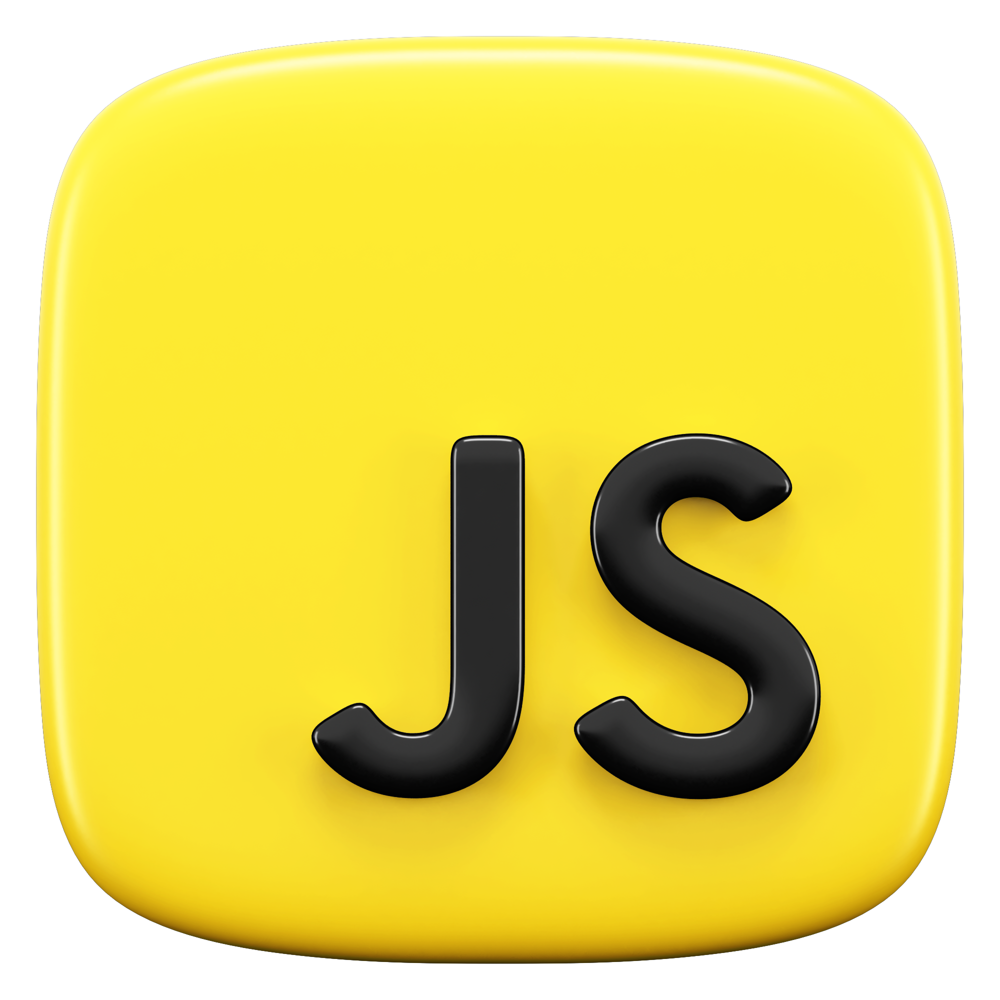

<div align="center">

<a id="top"></a>

# 📘 Learn JavaScript – Complete Guide & Practice Repository  


<!-- line break -->


**⭐ Star this repository if you found it helpful! ⭐**

---

**[Explore Programs](#explore-programs)** • 
**[Getting Started](#quick-start-guide)** • 
**[Contributing](#contributing)** •
**[Connect](#connect--collaborate)**

---

</div>

## 📌 Overview  

> Welcome to the **Learn JavaScript Repository** 🚀  
A structured and beginner-friendly collection of **JavaScript concepts, examples and practice programs** designed to help you master JavaScript from **basics to advanced**.



This repository is ideal for:  
- 📚 Beginners starting JavaScript  
- 🧠 Students preparing for exams  
- 💼 Developers revising concepts  
- 🎯 Interview preparation  

## Explore Programs 

<div align="center">

| Module | Description |  Link |
|----------|--------------|--------|
| 01_Basics | Variables, Data Types, Convertion, String, Number-Math, Dates | 🔗[`View`](./01_Basics/) |
| 02_Basics | Arrays, Objects | 🔗[`View`](./02_Basics/) |
| 03_Basics | Functions, Scopes, Arrow-Functions, IIFE | 🔗[`View`](./03_Basics/) |
| 04_Control-Flow | if-else, comparison, switch | 🔗[`View`](./04_Control-Flow/) |
| 05_Iterations | All type of loops | 🔗[`View`](./05_Iterations/) |
| 10_OOPs | Classes-Objects, prototype, inheritance, static, call & bind, getter-setter  | 🔗[`View`](./10_OOPs/) |
| 11_FunWithJS | Closure, Lexical Scope  | 🔗[`View`](./11_FunWithJS/) |
| Notes | IMP Notes, Points & Links | 🔗[`View`](./Notes.txt/) |

</div>


## Getting Started

1. **Clone the repository**
   ```bash
   git clone https://github.com/YashvardhanJani/Learn_Javascript.git
   cd Learn_Javascript
   ```

## Contributing

Contributions are welcome! 🫱🏻‍🫲🏼 - see the [CONTRIBUTING](CONTRIBUTING.md) file for details.

## License

This project is licensed under the MIT License - see the [LICENSE](LICENSE) file for details.

---

## Connect & Collaborate

<p align="center">
  <a href="https://github.com/YashvardhanJani"></a>&nbsp;&nbsp;&nbsp;
  <a href="https://linkedin.com/in/yashvardhan-jani"></a>&nbsp;&nbsp;&nbsp;
  <a href="mailto:yashvardhanjani7@gmail.com"></a>
</p>

---

<div align="center">

**Made with ❤️ by Yashvardhan Jani | CSE Student @ PDEU**

---

⬆️ [Back to Top](#top)
